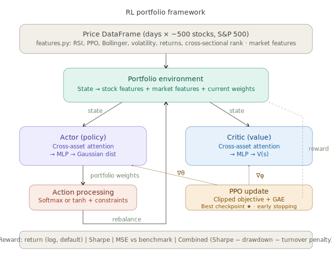

# RL Portfolio Optimization Framework

A deep reinforcement learning framework for portfolio optimization using PPO (Proximal Policy Optimization) with PyTorch. The agent learns to allocate capital across 100 stocks by observing market features and current holdings, then rebalancing at configurable intervals.

## Architecture



The framework follows a standard actor-critic loop. Price data flows through a feature engine that computes technical indicators and return statistics. The **portfolio environment** packages these into a state (per-stock features, market-level features, and current weights) and passes it to two separate networks:

- **Actor** — a policy network with cross-asset multi-head attention that outputs a Gaussian distribution over portfolio weights. Attention lets the model learn inter-stock dependencies rather than treating the 100-stock weight vector as flat.
- **Critic** — a value network (same attention architecture, separate parameters) that estimates V(s) for advantage computation.

Raw actions are mapped to valid weights through an **action processing** layer: softmax for long-only portfolios (weights in [0,1] summing to 1) or tanh with mean-centering for long-short (weights in [-1,1] summing to 0). A PPO update with clipped objective and Generalized Advantage Estimation keeps training stable.

## Modules

| File | Purpose |
|---|---|
| `config.py` | Typed dataclasses for all hyperparameters |
| `features.py` | Technical indicators and rolling normalization |
| `environment.py` | Gym-like portfolio environment with transaction costs |
| `networks.py` | Actor-critic networks with cross-asset attention |
| `agent.py` | PPO agent with GAE and rollout buffer |
| `trainer.py` | Training loop with evaluation and checkpointing |
| `utils.py` | Performance metrics and plotting utilities |
| `main.py` | Example usage with synthetic data |

## Quickstart

```bash
pip install torch pandas numpy
```

```python
from rl_portfolio import Config, create_and_train

# prices: pd.DataFrame with DatetimeIndex rows (days) and stock columns
agent, results = create_and_train(prices, Config())
```

Or run the included example with synthetic data:

```bash
python -m rl_portfolio.main
```

## Configuration

All settings are controlled through the `Config` dataclass. Key options:

```python
from rl_portfolio import Config, EnvironmentConfig, TrainingConfig

config = Config(
    env=EnvironmentConfig(
        mode="long_only",           # or "long_short"
        rebalance_freq="monthly",   # or "weekly"
        reward_type="combined",     # "sharpe", "mse", or "combined"
        transaction_cost_bps=10,
        max_position_size=0.05,
    ),
    training=TrainingConfig(
        n_episodes=500,
        lr_actor=3e-4,
        lr_critic=1e-3,
    ),
)
```

## Features

The feature engine computes per-stock and market-level indicators from raw prices, all with rolling normalization to prevent look-ahead bias:

- Rolling returns (5, 10, 21, 63 day)
- Rolling volatility (10, 21, 63 day)
- RSI, MACD histogram, Bollinger Band position
- Momentum at multiple horizons
- Cross-sectional return rank
- Average pairwise correlation, market return/volatility, return dispersion

## Reward Options

- **Sharpe** — annualized Sharpe ratio of holding-period returns
- **MSE** — negative squared deviation from an equal-weight benchmark
- **Combined** (default) — Sharpe minus a drawdown penalty and a turnover penalty, encouraging stable, cost-aware portfolios

## Requirements

- Python 3.10+
- PyTorch
- pandas
- NumPy
- matplotlib (optional, for plotting)